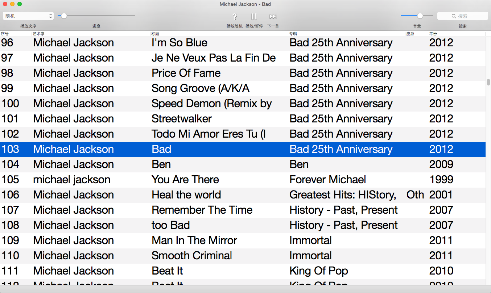
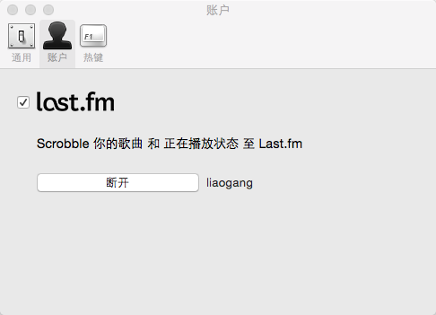
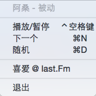

#[Download](https://github.com/uPlayer/uPlayer/releases/latest)  

Requires OS X 10.10 Yosemite 

#uPlayer  

uPlayer is an open source audio player for OS X .

#LastFm is Supportted  

#An status menu is convenient

